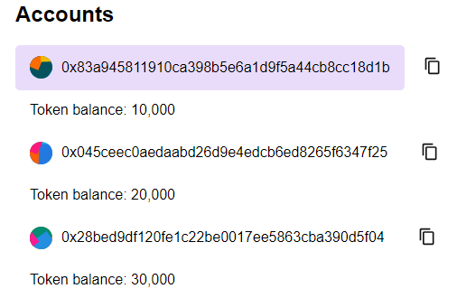

## Week 1 project - ECDSA Node

## Quick start

Clone the repo and cd into the folder:

```bash
git clone

cd folder_name
```

To install the dependencies, split your terminal and then run the following commands:

```bash
# In one terminal run:
cd client
npm install

# In the other one:
cd server
npm install
```

Start server and client:

```bash
# On the client terminal run:
npm run dev

# On the server terminal run:
npm start
```

## Using the application

After the UI is rendered on the browser, three wallets with a balance of tokens will be avaliable for you. In order to send transactions first you need to connect to a wallet by clicking it:

<div align="center">
  <figure >
    
  </figure>
  <div>
    <figcaption>Figure. 1 - Connected wallet.</figcaption>
  </div>
</div>

If you want a new set of wallet just reload the page.

### Client overview

The client has the following responsabilities:

- Render an UI on the brower.
- Creating a hash message and a Signature using the connected wallet's private key.
- Creating the transaction to send to the server.

### Server overview

The server has the following responsabilities:

- Creating the wallets and sending them to the client.
- After a request from the client to execute a transaction, the server will cryptographically prove if the sender of the transaction is in fact the signer by retrieving the public key using the signature and the message.
- If the sender owns the private will update the balances of the sender and recipient.

## Conclusion

Users will use their private keys to signed a transactions to create a message and a signature. After sending the transaction a Ethereum node will cryptographically verify if the sender of the transaction controls the private key by deriving the public from the signature and the message.

If the retrieved address is equal to the sender then it's proved only the sender could've sent that transaction, otherwise the transaction will be reverted.

## Acknowledgements

Thanks to the [Alchemy University](https://www.alchemy.com/dapps/alchemy-university) team for making the Ethereum Bootcamp accessible to anyone who want to become a web3 engineer.
